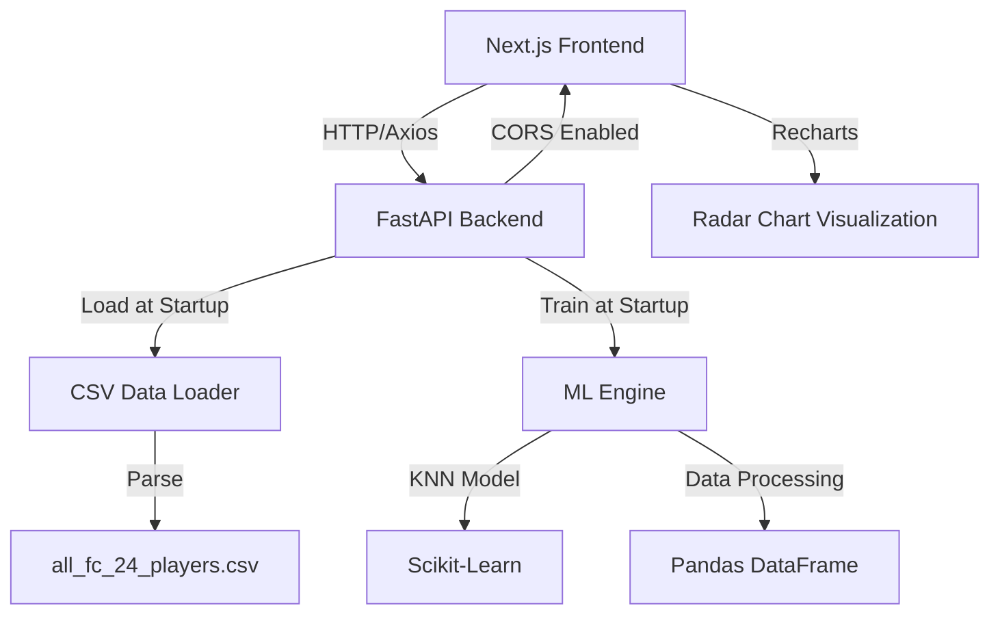
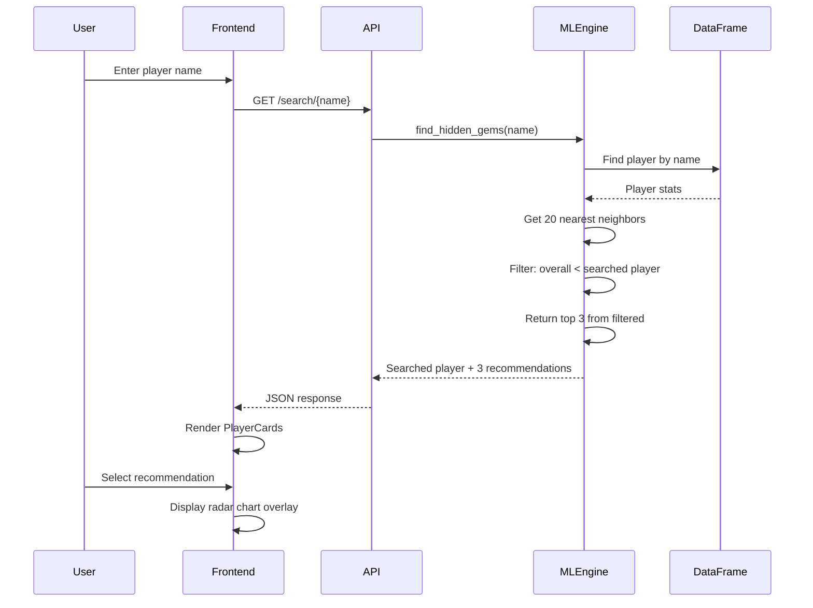

# Design Document: Scout AI Hidden Gems

## Overview

Scout AI is a web application that helps football scouts discover "Hidden Gems" - lesser-known players who are statistically similar to famous stars but have lower overall ratings. The system uses machine learning (K-Nearest Neighbors) to analyze player statistics from FC 24 data and recommend undervalued players with similar playing styles. The backend uses FastAPI with scikit-learn for ML processing, while the frontend provides a cyberpunk-themed dark UI built with Next.js 14 and Tailwind CSS.

## Architecture



## Main Algorithm/Workflow



## Components and Interfaces

### Backend Components

#### Component 1: FastAPI Application (main.py)

**Purpose**: HTTP server that handles search requests and serves ML predictions

**Interface**:
```python
from fastapi import FastAPI
from fastapi.middleware.cors import CORSMiddleware

app = FastAPI()

@app.on_event("startup")
async def startup_event():
    """Initialize ML engine and load data at startup"""
    pass

@app.get("/search/{player_name}")
async def search_player(player_name: str) -> SearchResponse:
    """Search for player and return hidden gem recommendations"""
    pass

@app.get("/health")
async def health_check() -> dict:
    """Health check endpoint"""
    pass
```

**Responsibilities**:
- Configure CORS for localhost:3000
- Initialize ML engine at startup
- Route search requests to ML engine
- Return JSON responses with player data

#### Component 2: ML Engine (ml_engine.py)

**Purpose**: Machine learning core that finds similar players using K-Nearest Neighbors

**Interface**:
```python
from typing import List, Dict
import pandas as pd
from sklearn.neighbors import NearestNeighbors

class MLEngine:
    def __init__(self):
        self.df: pd.DataFrame = None
        self.model: NearestNeighbors = None
        self.feature_columns: List[str] = None
        
    def load_data(self, csv_path: str) -> None:
        """Load and clean CSV data"""
        pass
    
    def train_model(self) -> None:
        """Train KNN model on player statistics"""
        pass
    
    def find_hidden_gems(self, player_name: str) -> Dict:
        """Find top 3 hidden gems similar to given player"""
        pass
    
    def _get_player_stats(self, player_name: str) -> pd.Series:
        """Retrieve player statistics from DataFrame"""
        pass
    
    def _filter_lower_rated(self, neighbors: List, target_rating: int) -> List:
        """Filter neighbors to keep only lower-rated players"""
        pass
```

**Responsibilities**:
- Load CSV data into Pandas DataFrame at startup (global state)
- Clean data: fill nulls with mean for numeric columns
- Select feature columns: PAC, SHO, PAS, DRI, DEF, PHY
- Train NearestNeighbors model with n_neighbors=20
- Find similar players and filter by overall rating
- Return top 3 recommendations

### Frontend Components

#### Component 3: SearchBar Component

**Purpose**: Central search input for player name queries

**Interface**:
```typescript
interface SearchBarProps {
  onSearch: (playerName: string) => void;
  isLoading: boolean;
}

export function SearchBar({ onSearch, isLoading }: SearchBarProps): JSX.Element
```

**Responsibilities**:
- Large centered input field with search icon
- Handle user input and trigger search
- Display loading state during API calls
- Cyberpunk green/black styling

#### Component 4: PlayerCard Component

**Purpose**: Display player information in a card format

**Interface**:
```typescript
interface PlayerCardProps {
  player: Player;
  isHiddenGem?: boolean;
  onSelect?: (player: Player) => void;
}

interface Player {
  name: string;
  club: string;
  nation: string;
  position: string;
  overall: number;
  stats: PlayerStats;
}

interface PlayerStats {
  PAC: number;
  SHO: number;
  PAS: number;
  DRI: number;
  DEF: number;
  PHY: number;
}

export function PlayerCard({ player, isHiddenGem, onSelect }: PlayerCardProps): JSX.Element
```

**Responsibilities**:
- Display player name, team, overall rating
- Show "Hidden Gem" badge for recommendations
- Handle click events for radar chart comparison
- Dark mode cyberpunk styling

#### Component 5: RadarChart Component

**Purpose**: Visualize statistical comparison between searched player and selected recommendation

**Interface**:
```typescript
interface RadarChartProps {
  searchedPlayer: Player;
  comparisonPlayer: Player;
}

export function RadarChart({ searchedPlayer, comparisonPlayer }: RadarChartProps): JSX.Element
```

**Responsibilities**:
- Use Recharts library for radar visualization
- Overlay two players' stats (PAC, SHO, PAS, DRI, DEF, PHY)
- Color code: searched player (green), comparison (cyan)
- Responsive sizing

#### Component 6: API Client (lib/api.ts)

**Purpose**: Axios-based HTTP client for backend communication

**Interface**:
```typescript
import axios from 'axios';

const apiClient = axios.create({
  baseURL: 'http://localhost:8000',
  timeout: 5000,
});

export async function searchPlayer(playerName: string): Promise<SearchResponse>

export interface SearchResponse {
  searched_player: Player;
  hidden_gems: Player[];
}
```

**Responsibilities**:
- Configure Axios with backend URL
- Handle search API calls
- Parse JSON responses
- Error handling for network failures

## Data Models

### Backend Models

#### Model 1: SearchResponse

```python
from pydantic import BaseModel
from typing import List

class PlayerStats(BaseModel):
    PAC: int
    SHO: int
    PAS: int
    DRI: int
    DEF: int
    PHY: int

class Player(BaseModel):
    name: str
    club: str
    nation: str
    position: str
    overall: int
    stats: PlayerStats

class SearchResponse(BaseModel):
    searched_player: Player
    hidden_gems: List[Player]
```

**Validation Rules**:
- All stat values must be integers between 0-99
- hidden_gems list must contain exactly 3 players
- Player names must be non-empty strings

### Frontend Models

#### Model 2: Player (TypeScript)

```typescript
export interface Player {
  name: string;
  club: string;
  nation: string;
  position: string;
  overall: number;
  stats: PlayerStats;
}

export interface PlayerStats {
  PAC: number;
  SHO: number;
  PAS: number;
  DRI: number;
  DEF: number;
  PHY: number;
}

export interface SearchResponse {
  searched_player: Player;
  hidden_gems: Player[];
}
```

**Validation Rules**:
- All fields are required (non-nullable)
- overall must be between 0-99
- stats values must be between 0-99

## Algorithmic Pseudocode

### Main Processing Algorithm: find_hidden_gems

```python
def find_hidden_gems(player_name: str) -> SearchResponse:
    """
    Find hidden gem players similar to the searched player.
    
    Preconditions:
    - player_name is non-empty string
    - DataFrame is loaded and not empty
    - KNN model is trained
    
    Postconditions:
    - Returns SearchResponse with exactly 3 hidden gems
    - All hidden gems have overall < searched_player.overall
    - Hidden gems are ordered by similarity (most similar first)
    
    Loop Invariants:
    - All filtered players have overall < target_rating
    """
    # Step 1: Find searched player in DataFrame
    player_row = df[df['name'].str.lower() == player_name.lower()]
    
    if player_row.empty:
        raise ValueError(f"Player '{player_name}' not found")
    
    target_rating = player_row['overall'].values[0]
    player_stats = player_row[feature_columns].values
    
    # Step 2: Find 20 nearest neighbors using KNN
    distances, indices = model.kneighbors(player_stats, n_neighbors=21)
    
    # Skip first result (the player itself)
    neighbor_indices = indices[0][1:]
    neighbor_distances = distances[0][1:]
    
    # Step 3: Filter neighbors with lower overall rating
    hidden_gems = []
    for idx, dist in zip(neighbor_indices, neighbor_distances):
        neighbor = df.iloc[idx]
        
        # Loop invariant: only add if overall < target_rating
        if neighbor['overall'] < target_rating:
            hidden_gems.append({
                'player': neighbor,
                'distance': dist
            })
    
    # Step 4: Return top 3 from filtered list
    hidden_gems_sorted = sorted(hidden_gems, key=lambda x: x['distance'])[:3]
    
    # Build response
    searched_player = build_player_object(player_row.iloc[0])
    gems = [build_player_object(gem['player']) for gem in hidden_gems_sorted]
    
    return SearchResponse(
        searched_player=searched_player,
        hidden_gems=gems
    )
```

### Data Loading Algorithm: load_and_clean_data

```python
def load_and_clean_data(csv_path: str) -> pd.DataFrame:
    """
    Load CSV and clean data for ML processing.
    
    Preconditions:
    - csv_path points to valid CSV file
    - CSV contains required columns: name, overall, PAC, SHO, PAS, DRI, DEF, PHY
    
    Postconditions:
    - Returns DataFrame with no null values in feature columns
    - All feature columns are numeric
    - DataFrame has at least 100 rows
    """
    # Step 1: Load CSV
    df = pd.read_csv(csv_path)
    
    # Step 2: Select feature columns
    feature_columns = ['PAC', 'SHO', 'PAS', 'DRI', 'DEF', 'PHY']
    required_columns = ['name', 'club', 'nation', 'position', 'overall'] + feature_columns
    
    # Step 3: Fill null values with column mean
    for col in feature_columns:
        if df[col].isnull().any():
            mean_value = df[col].mean()
            df[col].fillna(mean_value, inplace=True)
    
    # Step 4: Ensure numeric types
    for col in feature_columns:
        df[col] = pd.to_numeric(df[col], errors='coerce')
    
    # Step 5: Drop rows with remaining nulls in required columns
    df = df.dropna(subset=required_columns)
    
    return df
```

### Model Training Algorithm: train_knn_model

```python
def train_knn_model(df: pd.DataFrame, feature_columns: List[str]) -> NearestNeighbors:
    """
    Train K-Nearest Neighbors model on player statistics.
    
    Preconditions:
    - df is non-empty DataFrame
    - feature_columns exist in df
    - All feature values are numeric
    
    Postconditions:
    - Returns trained NearestNeighbors model
    - Model can find k=20 neighbors
    - Training completes in <200ms
    """
    # Extract feature matrix
    X = df[feature_columns].values
    
    # Initialize KNN with cosine similarity
    model = NearestNeighbors(
        n_neighbors=20,
        metric='cosine',
        algorithm='brute'
    )
    
    # Fit model
    model.fit(X)
    
    return model
```

## Key Functions with Formal Specifications

### Function 1: startup_event()

```python
@app.on_event("startup")
async def startup_event():
    """Initialize ML engine at application startup"""
    pass
```

**Preconditions:**
- CSV file exists at backend/data/all_fc_24_players.csv
- File is readable and properly formatted

**Postconditions:**
- Global ml_engine instance is initialized
- DataFrame is loaded with >1000 player records
- KNN model is trained and ready
- Startup completes in <2 seconds

**Loop Invariants:** N/A

### Function 2: search_player()

```python
@app.get("/search/{player_name}")
async def search_player(player_name: str) -> SearchResponse:
    """Search for player and return hidden gems"""
    pass
```

**Preconditions:**
- player_name is non-empty string
- ML engine is initialized
- Player exists in database

**Postconditions:**
- Returns SearchResponse with valid data
- Response time <200ms
- hidden_gems contains exactly 3 players
- All hidden gems have overall < searched_player.overall

**Loop Invariants:** N/A

### Function 3: find_hidden_gems()

```python
def find_hidden_gems(self, player_name: str) -> Dict:
    """Find top 3 hidden gems similar to given player"""
    pass
```

**Preconditions:**
- player_name exists in DataFrame
- KNN model is trained
- DataFrame has sufficient players for filtering

**Postconditions:**
- Returns dict with 'searched_player' and 'hidden_gems' keys
- hidden_gems list has 3 players (or fewer if insufficient lower-rated players)
- All returned players have complete stat data
- Results are deterministic for same input

**Loop Invariants:**
- During neighbor filtering: all added players have overall < target_rating

## Example Usage

### Backend Usage

```python
# main.py
from fastapi import FastAPI, HTTPException
from ml_engine import MLEngine

app = FastAPI()
ml_engine = None

@app.on_event("startup")
async def startup_event():
    global ml_engine
    ml_engine = MLEngine()
    ml_engine.load_data("backend/data/all_fc_24_players.csv")
    ml_engine.train_model()

@app.get("/search/{player_name}")
async def search_player(player_name: str):
    try:
        result = ml_engine.find_hidden_gems(player_name)
        return result
    except ValueError as e:
        raise HTTPException(status_code=404, detail=str(e))

# Run with: uvicorn main:app --reload --port 8000
```

### Frontend Usage

```typescript
// app/page.tsx
'use client';

import { useState } from 'react';
import { SearchBar } from '@/components/SearchBar';
import { PlayerCard } from '@/components/PlayerCard';
import { RadarChart } from '@/components/RadarChart';
import { searchPlayer } from '@/lib/api';

export default function Home() {
  const [searchResult, setSearchResult] = useState(null);
  const [selectedGem, setSelectedGem] = useState(null);
  const [isLoading, setIsLoading] = useState(false);

  const handleSearch = async (playerName: string) => {
    setIsLoading(true);
    try {
      const result = await searchPlayer(playerName);
      setSearchResult(result);
      setSelectedGem(null);
    } catch (error) {
      console.error('Search failed:', error);
    } finally {
      setIsLoading(false);
    }
  };

  return (
    <div className="min-h-screen bg-black text-green-400">
      <SearchBar onSearch={handleSearch} isLoading={isLoading} />
      
      {searchResult && (
        <div className="grid grid-cols-1 md:grid-cols-2 gap-4 p-8">
          <PlayerCard player={searchResult.searched_player} />
          
          <div className="space-y-4">
            {searchResult.hidden_gems.map((gem) => (
              <PlayerCard
                key={gem.name}
                player={gem}
                isHiddenGem
                onSelect={setSelectedGem}
              />
            ))}
          </div>
        </div>
      )}
      
      {selectedGem && searchResult && (
        <RadarChart
          searchedPlayer={searchResult.searched_player}
          comparisonPlayer={selectedGem}
        />
      )}
    </div>
  );
}
```

## Correctness Properties

*A property is a characteristic or behavior that should hold true across all valid executions of a system-essentially, a formal statement about what the system should do. Properties serve as the bridge between human-readable specifications and machine-verifiable correctness guarantees.*

### Property 1: Hidden Gems Always Lower Rated

*For any* search result, every hidden gem must have an overall rating strictly less than the searched player's overall rating.

**Validates: Requirements 2.1**

### Property 2: Bounded Hidden Gem Count

*For any* search result, the number of hidden gems returned must be between 0 and 3 (inclusive).

**Validates: Requirements 2.2, 2.3**

### Property 3: Hidden Gems from K-Nearest Neighbors

*For any* search result, all hidden gems must be selected from the 20 nearest neighbors of the searched player based on statistical similarity.

**Validates: Requirements 2.4**

### Property 4: Hidden Gems Ordered by Similarity

*For any* search result with multiple hidden gems, the hidden gems must be ordered by similarity distance in ascending order (most similar first).

**Validates: Requirements 2.5**

### Property 5: Response Structure Completeness

*For any* successful search response, the response must contain both searched_player and hidden_gems fields, all players must have the required fields (name, club, nation, position, overall, stats), all Player_Stats must have the six attributes (PAC, SHO, PAS, DRI, DEF, PHY), and all numeric values must be properly typed.

**Validates: Requirements 5.3, 6.3, 7.3, 7.4, 7.5**

### Property 6: Case-Insensitive Player Matching

*For any* player name in the dataset, searching with different case variations (uppercase, lowercase, mixed case) must return the same player and hidden gems.

**Validates: Requirements 1.5**

### Property 7: Non-Existent Player Error Handling

*For any* player name that does not exist in the dataset, the system must return an error response indicating the player was not found.

**Validates: Requirements 1.2**

### Property 8: Null Value Imputation

*For any* CSV data loaded with null values in Player_Stats columns, all null values must be replaced with the column mean, resulting in no null values in the processed dataset.

**Validates: Requirements 3.2**

### Property 9: Radar Chart Data Completeness

*For any* radar chart rendered for player comparison, the chart must display all six Player_Stats attributes (PAC, SHO, PAS, DRI, DEF, PHY) for both players.

**Validates: Requirements 4.2**

### Property 10: Player Display Field Completeness

*For any* player displayed in the UI, the rendered output must include the player's name, club, nation, position, and overall rating.

**Validates: Requirements 5.1**

### Property 11: Hidden Gem Visual Indicator

*For any* hidden gem recommendation displayed in the UI, the rendered output must include a visual indicator (badge or label) distinguishing it from the searched player.

**Validates: Requirements 5.2**

### Property 12: Stat Value Validation

*For any* Player_Stats values processed by the system, all values must be integers between 0 and 99 (inclusive).

**Validates: Requirements 7.1**

### Property 13: Player Name Validation

*For any* player name processed by the system, the name must be a non-empty string.

**Validates: Requirements 7.2**

### Property 14: Searched Player Exclusion

*For any* search result, the searched player must not appear in the hidden_gems list.

**Validates: Requirements 8.4**

### Property 15: Deterministic Search Results

*For any* player name, performing multiple searches with the same name must produce identical results (same hidden gems in the same order).

**Validates: Requirements 8.5**

## Error Handling

### Error Scenario 1: Player Not Found

**Condition**: User searches for a player name that doesn't exist in the database
**Response**: Return HTTP 404 with error message "Player '{name}' not found"
**Recovery**: Frontend displays error message and keeps search bar active for retry

### Error Scenario 2: Insufficient Hidden Gems

**Condition**: Searched player is lowest-rated among similar players (no lower-rated neighbors)
**Response**: Return empty hidden_gems array with searched_player data
**Recovery**: Frontend displays message "No hidden gems found for this player - they're already undervalued!"

### Error Scenario 3: CSV Load Failure

**Condition**: CSV file missing or corrupted at startup
**Response**: Application fails to start with clear error message in logs
**Recovery**: Admin must fix CSV file and restart application

### Error Scenario 4: Network Timeout

**Condition**: Frontend request to backend exceeds 5-second timeout
**Response**: Axios throws timeout error
**Recovery**: Frontend displays "Request timed out. Please try again." and enables retry

### Error Scenario 5: CORS Blocked

**Condition**: Frontend running on different port than configured CORS
**Response**: Browser blocks request with CORS error
**Recovery**: Backend CORS configuration must be updated to allow origin

## Testing Strategy

### Unit Testing Approach

**Backend Tests (pytest)**:
- Test `load_and_clean_data()` with sample CSV
- Test `train_knn_model()` with mock DataFrame
- Test `find_hidden_gems()` with known player names
- Test edge cases: empty results, single result, exact 3 results
- Mock DataFrame and KNN model for isolated testing

**Frontend Tests (Jest + React Testing Library)**:
- Test SearchBar component: input handling, loading states
- Test PlayerCard component: rendering, click events
- Test RadarChart component: data visualization with mock data
- Test API client: mock Axios responses
- Snapshot tests for UI components

### Property-Based Testing Approach

**Property Test Library**: Hypothesis (Python), fast-check (TypeScript)

**Backend Properties**:
1. **Monotonic Rating Property**: All hidden gems have lower overall rating than searched player
2. **Bounded Results Property**: Result count is always 0-3
3. **Determinism Property**: Same input always produces same output
4. **Distance Ordering Property**: Hidden gems are ordered by similarity distance

**Frontend Properties**:
1. **UI Consistency Property**: PlayerCard always renders with all required fields
2. **Chart Data Property**: RadarChart receives exactly 6 stat points per player

### Integration Testing Approach

**End-to-End Tests (Playwright)**:
1. Start backend server with test database
2. Start frontend development server
3. Test complete user flow:
   - Enter "Kylian Mbappé" in search
   - Verify 3 hidden gems appear
   - Click on first hidden gem
   - Verify radar chart displays
   - Verify all stats are visible
4. Test error scenarios:
   - Search for non-existent player
   - Verify error message displays
5. Performance test: Verify search completes in <500ms

## Performance Considerations

**Backend Optimization**:
- Load CSV into memory at startup (global state) to avoid repeated disk I/O
- Use Pandas vectorized operations for data cleaning
- KNN model trained once at startup, not per request
- Target response time: <200ms per search request
- Use cosine similarity for faster computation than Euclidean distance

**Frontend Optimization**:
- Debounce search input (300ms) to reduce API calls
- Use React.memo for PlayerCard components to prevent unnecessary re-renders
- Lazy load RadarChart component only when needed
- Implement loading skeletons for better perceived performance
- Cache search results in component state

**Scalability Considerations**:
- Current design optimized for single-server deployment
- For production: consider Redis caching for frequent searches
- For large datasets (>100k players): consider approximate nearest neighbors (Annoy, FAISS)

## Security Considerations

**Input Validation**:
- Sanitize player_name parameter to prevent SQL injection (though using Pandas, not SQL)
- Limit player_name length to 100 characters
- Validate player_name contains only alphanumeric and space characters

**CORS Configuration**:
- Restrict CORS to specific origins in production (not wildcard)
- Development: Allow localhost:3000
- Production: Allow only production frontend domain

**Rate Limiting**:
- Implement rate limiting on /search endpoint (e.g., 60 requests/minute per IP)
- Prevent abuse and DoS attacks

**Data Privacy**:
- Player data is public (FC 24 game data), no PII concerns
- No user authentication required for MVP
- Future: Add user accounts with OAuth2 for saved searches

## Dependencies

**Backend Dependencies** (requirements.txt):
```
fastapi==0.104.1
uvicorn[standard]==0.24.0
pandas==2.1.3
scikit-learn==1.3.2
python-multipart==0.0.6
pydantic==2.5.0
```

**Frontend Dependencies** (package.json):
```json
{
  "dependencies": {
    "next": "14.0.3",
    "react": "18.2.0",
    "react-dom": "18.2.0",
    "typescript": "5.3.2",
    "tailwindcss": "3.3.5",
    "axios": "1.6.2",
    "recharts": "2.10.3"
  },
  "devDependencies": {
    "@types/node": "20.9.0",
    "@types/react": "18.2.37",
    "@types/react-dom": "18.2.15"
  }
}
```

**System Requirements**:
- Python 3.9+
- Node.js 18+
- 2GB RAM minimum (for DataFrame in memory)
- 100MB disk space for CSV data
